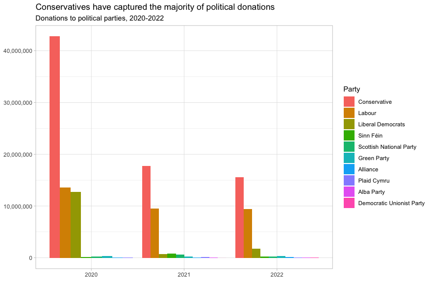
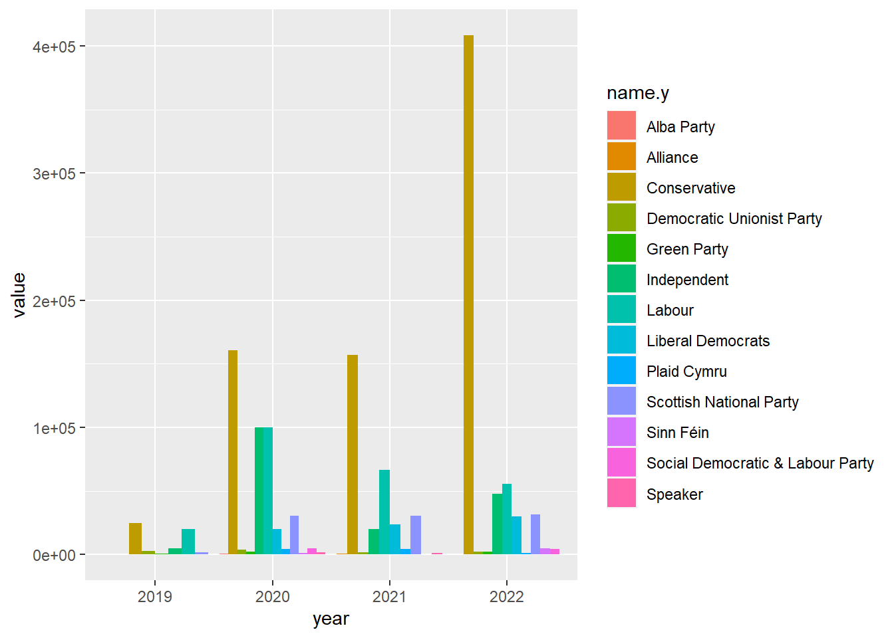
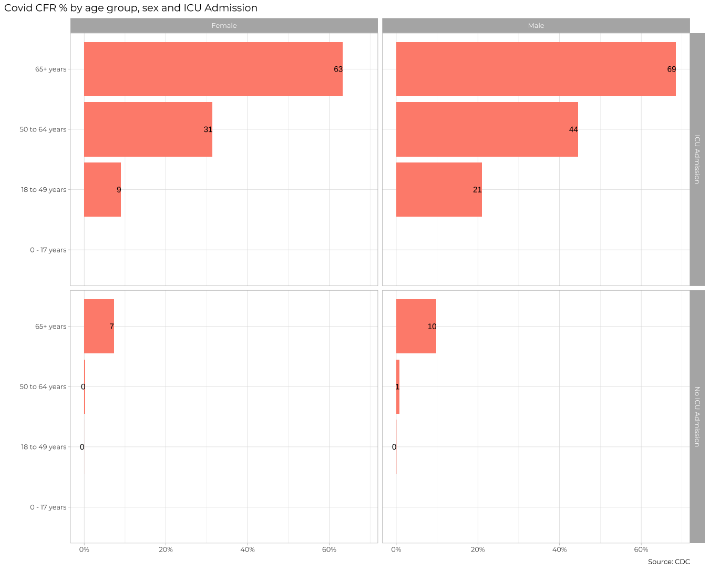
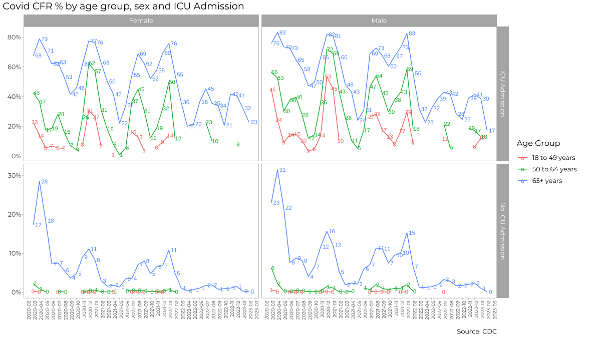
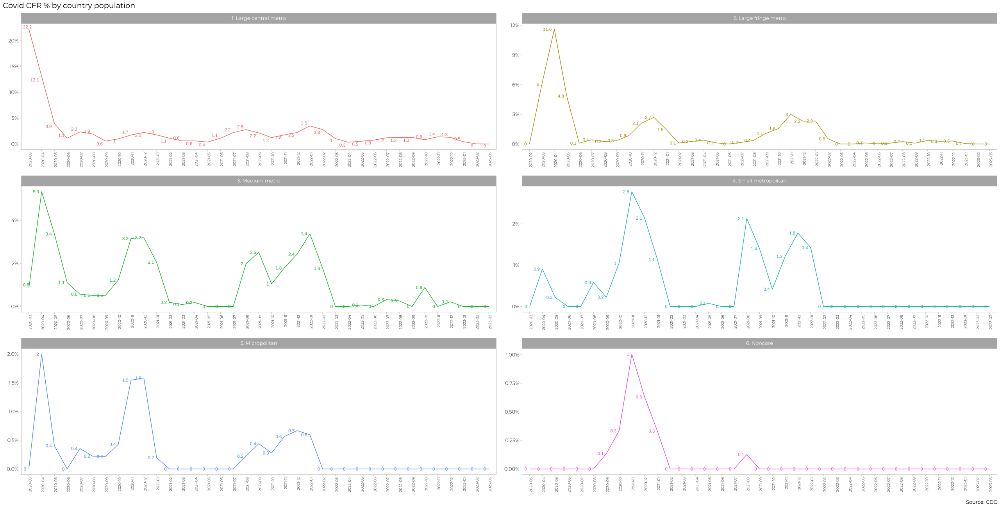
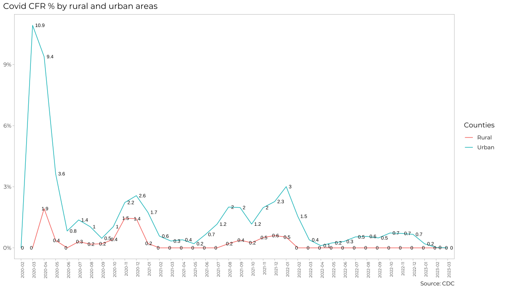

# Money in UK politics

[The Westminster Accounts](https://news.sky.com/story/the-westminster-accounts-12786091), a recent collaboration between Sky News and Tortoise Media, examines the flow of money through UK politics. It does so by combining data from three key sources: 

1. [Register of Members’ Financial Interests](https://www.parliament.uk/mps-lords-and-offices/standards-and-financial-interests/parliamentary-commissioner-for-standards/registers-of-interests/register-of-members-financial-interests/), 
1. [Electoral Commission records of donations to parties](http://search.electoralcommission.org.uk/English/Search/Donations), and
1. [Register of All-Party Parliamentary Groups](https://www.parliament.uk/mps-lords-and-offices/standards-and-financial-interests/parliamentary-commissioner-for-standards/registers-of-interests/register-of-all-party-party-parliamentary-groups/). 

You can [search and explore the results](https://news.sky.com/story/westminster-accounts-search-for-your-mp-or-enter-your-full-postcode-12771627) through the collaboration’s interactive database. Simon Willison [has extracted a database](https://til.simonwillison.net/shot-scraper/scraping-flourish) and this is what we will be working with. If you want to read more about [the project’s methodology](https://www.tortoisemedia.com/2023/01/08/the-westminster-accounts-methodology/).


## Open a connection to the database

The database made available by Simon Willison is an `SQLite` database


```r
sky_westminster <- DBI::dbConnect(
  drv = RSQLite::SQLite(),
  dbname = here::here("data", "sky-westminster-files.db")
)
```

How many tables does the database have?

it has 7 tables.


```r
DBI::dbListTables(sky_westminster)
```

```
## [1] "appg_donations"  "appgs"           "member_appgs"    "members"        
## [5] "parties"         "party_donations" "payments"
```

## Which MP has received the most amount of money? 

Theresa May recived the most money


```r
#Calculating the mp who has received the most amount of money
#glimpse both tables to understand structures
#set the tables into data frames with given names for ease
payments <- dplyr::tbl(sky_westminster, "payments")
glimpse(payments)
```

```
## Rows: ??
## Columns: 13
## Database: sqlite 3.41.2 [C:\Users\assad\OneDrive\Documents\dsb2023\data\sky-westminster-files.db]
## $ category             <chr> "4. Visits outside the UK", "2. (b) Any other sup…
## $ category_name        <chr> "Gifts and other benefits", "Cash donations", "Gi…
## $ charity              <chr> "", "", "", "", "", "", "", "", "", "", "", "", "…
## $ date                 <chr> "Registered in November 2021", "Registered in Jan…
## $ date_visited         <chr> "Dates of visit: 5-12 November 2021", "", "Dates …
## $ description          <chr> "International flights £805.07; accommodation £1,…
## $ destination_of_visit <chr> "Accra, Ghana", "", "Kingston, Jamaica", "", "", …
## $ entity               <chr> "GUBA Foundation", "Mahir Kilic", "People's Natio…
## $ hours                <chr> "", "", "", "", "", "", "", "", "", "", "", "", "…
## $ id                   <chr> "44a5c7f837d9df230b8c1e7f72eea188", "b9f40bd69ac2…
## $ member_id            <chr> "m172", "m172", "m172", "m172", "m172", "m44", "m…
## $ purpose_of_visit     <chr> "To participate in the GUBA Foundation Yaa Asante…
## $ value                <dbl> 2631.51, 2000.00, 2574.57, 2000.00, 500.00, 1800.…
```

```r
members <- dplyr::tbl(sky_westminster, "members")
glimpse(members)
```

```
## Rows: ??
## Columns: 7
## Database: sqlite 3.41.2 [C:\Users\assad\OneDrive\Documents\dsb2023\data\sky-westminster-files.db]
## $ id           <chr> "m8", "m1508", "m1423", "m4514", "m1211", "m3958", "m14",…
## $ name         <chr> "Theresa May", "Sir Geoffrey Cox", "Boris Johnson", "Keir…
## $ gender       <chr> "F", "M", "M", "M", "M", "F", "M", "M", "F", "M", "F", "M…
## $ constituency <chr> "Maidenhead", "Torridge and West Devon", "Uxbridge and So…
## $ party_id     <chr> "p4", "p4", "p4", "p15", "p4", "p4", "p4", "p4", "p4", "p…
## $ short_name   <chr> "Mrs May", "Sir Geoffrey", "Mr Johnson", "Mr Starmer", "M…
## $ status       <chr> "active", "active", "active", "active", "active", "active…
```

```r
#join the 2 tables on ID

member_payments <- left_join(x = members, y = payments, c("id"="member_id")) %>% 
  #group by MP Name
  group_by(name) %>% 
  #Summarise total value accrued by MP
  summarise(Total_Value = sum(value)) %>% 
  #Arrange descending
  arrange(desc(Total_Value))

#pull top row which is MP with the most amount of money recived
head(member_payments,7)
```

```
## Warning: Missing values are always removed in SQL aggregation functions.
## Use `na.rm = TRUE` to silence this warning
## This warning is displayed once every 8 hours.
```

```
## # Source:     SQL [7 x 2]
## # Database:   sqlite 3.41.2 [C:\Users\assad\OneDrive\Documents\dsb2023\data\sky-westminster-files.db]
## # Ordered by: desc(Total_Value)
##   name             Total_Value
##   <chr>                  <dbl>
## 1 Theresa May         2809765.
## 2 Sir Geoffrey Cox    2191387.
## 3 Boris Johnson       1282402 
## 4 Keir Starmer         799936.
## 5 Andrew Mitchell      769373.
## 6 Fiona Bruce          712321.
## 7 John Redwood         692438.
```


## Any `entity` that accounts for more than 5% of all donations?

Is there any `entity` whose donations account for more than 5% of the total payments given to MPs over the 2020-2022 interval? Who are they and who did they give money to?


```r
total_money <- payments %>% 
              #summarise total value
              summarise(total= sum(value))

Entity_values <- left_join(x = members, y = payments, c("id"="member_id")) %>%
  #select relevant column
  select(entity,value) %>% 
  #mutate for a % of total value column
  mutate(Percentage=value/sum(value)) %>% 
  #group by entity
  group_by(entity) %>% 
  #Arrange descending
  arrange(desc(Percentage))

#view top entities
head(Entity_values)
```

```
## # Source:     SQL [6 x 3]
## # Database:   sqlite 3.41.2 [C:\Users\assad\OneDrive\Documents\dsb2023\data\sky-westminster-files.db]
## # Groups:     entity
## # Ordered by: desc(Percentage)
##   entity                                  value Percentage
##   <chr>                                   <dbl>      <dbl>
## 1 Cambridge Speaker Series              408200     0.0118 
## 2 Centerview Partners LLP               277724.    0.00805
## 3 Council of Insurance Agents & Brokers 276130     0.00800
## 4 Hindustan Times                       261652.    0.00758
## 5 Televisao Independente                215276.    0.00624
## 6 JP Morgan Chase                       160370     0.00465
```
no entity has more than 5% of total donations

## Do `entity` donors give to a single party or not?

- How many distinct entities who paid money to MPS are there?


```r
payments %>%
  #filter for values >0 to avpid entiities with no payments made
  filter(value>0) %>% 
  #select relevant column for entities only
  select(entity) %>% 
  #count distinct
  summarise(Count=n_distinct(entity)) 
```

```
## # Source:   SQL [1 x 1]
## # Database: sqlite 3.41.2 [C:\Users\assad\OneDrive\Documents\dsb2023\data\sky-westminster-files.db]
##   Count
##   <int>
## 1  2213
```

there were 2213 distinct entities that paid money to MP's

- How many (as a number and %) donated to MPs belonging to a single party only?


```r
#implies we want to select MP's who only have 1 party ID
#create a count by LP for number of parties they are associated with in the data

multiple_parties <- left_join(x = members, y = payments, c("id"="member_id")) %>%
  #group by MP
  group_by(entity) %>% 
  #summarise distinct parties donated to by entity
  summarise(count_party=n_distinct(party_id)) %>% 
  #filter out any with count>1
  filter(count_party<2 & !is.na(count_party))

#1000 entities have donated only to 1 party
#% donated to 1 party of total
one_party=1000
distinct_entities=2213
percent_1_party = one_party/distinct_entities

#view %
head(percent_1_party)
```

```
## [1] 0.4518753
```
1000 entities only donated to 1 part, which equates to ~45% of all entities that donated




```r
#plotting the above graph
#glipmse the parties table for the matching join column
parties <- dplyr::tbl(sky_westminster, "parties")
glimpse(parties)
```

```
## Rows: ??
## Columns: 5
## Database: sqlite 3.41.2 [C:\Users\assad\OneDrive\Documents\dsb2023\data\sky-westminster-files.db]
## $ abbrev     <chr> "Alba", "Alliance", "Con", "DUP", "Green", "Ind", "Lab", "L…
## $ background <chr> "0015ff", "C0C0C0", "0000ff", "80", "78b82a", "C0C0C0", "ff…
## $ foreground <chr> "", "FFFFFF", "ffffff", "FFFFFF", "FFFFFF", "FFFFFF", "ffff…
## $ id         <chr> "p1034", "p1", "p4", "p7", "p44", "p8", "p15", "p17", "p22"…
## $ name       <chr> "Alba Party", "Alliance", "Conservative", "Democratic Union…
```

```r
#convert dates to years
left_join(x = members, y = payments, c("id"="member_id")) %>%
    left_join(parties, c("party_id"="id")) %>% 
    #mutate the date into a new yearly column
    mutate(year= str_sub(date,-4,-1)) %>% 
    #filter out for years >=2020
    filter(year>=2020) %>% 
    #group by year an political aprty
    group_by(year,name.y) %>% 
    #arrange descending year
    arrange(desc(year)) %>% 
    ggplot(aes(year,value)) +
    geom_bar(aes(fill = name.y), stat = "identity", position = "dodge")
```



```r
#short on time so had to skip. remaning issue is to find out by 2019/NA clumns still show after filter and to reorder the clustered bar charts descending to match and rename the elgends/axes
```


This uses the default ggplot colour pallete, as I dont want you to worry about using the [official colours for each party](https://en.wikipedia.org/wiki/Wikipedia:Index_of_United_Kingdom_political_parties_meta_attributes). However, I would like you to ensure the parties are sorted according to total donations and not alphabetically. You may even want to remove some of the smaller parties that hardly register on the graph. Would facetting help you?  

Finally, when you are done working with the databse, make sure you close the connection, or disconnect from the database.


```r
dbDisconnect(sky_westminster)
```


# Anonymised Covid patient data from the CDC

We will be using a dataset with [anonymous Covid-19 patient data that the CDC publishes every month](https://data.cdc.gov/Case-Surveillance/COVID-19-Case-Surveillance-Public-Use-Data-with-Ge/n8mc-b4w4). The file we will use was released on April 11, 2023, and has data on 98 million of patients, with 19 features. This file cannot be loaded in memory, but luckily we have the data in `parquet` format and we will use the `{arrow}` package.

## Obtain the data

The dataset `cdc-covid-geography` in in `parquet` format that {arrow}can handle. It is > 600Mb and too large to be hosted on Canvas or Github, so please download it from dropbox https://www.dropbox.com/sh/q1yk8mmnbbrzavl/AAAxzRtIhag9Nc_hODafGV2ka?dl=0 and save it in your `dsb` repo, under the `data` folder


```
## 0.03 sec elapsed
```

```
## [1] 97799772
```

```
## [1] "FileSystemDataset" "Dataset"           "ArrowObject"      
## [4] "R6"
```
Can you query the database and replicate the following plot?



The previous plot is an aggregate plot for all three years of data. What if we wanted to plot Case Fatality Ratio (CFR) over time? Write code that collects the relevant data from the database and plots the following





For each patient, the dataframe also lists the patient's states and county [FIPS code](https://en.wikipedia.org/wiki/Federal_Information_Processing_Standard_state_code). The CDC also has information on the [NCHS Urban-Rural classification scheme for counties](https://www.cdc.gov/nchs/data_access/urban_rural.htm)

```r
#load in the new data and clean columns
urban_rural <- read_xlsx(here::here("data", "NCHSURCodes2013.xlsx")) %>% 
  janitor::clean_names() 
```


Each county belongs in six different categoreis, with categories 1-4 being urban areas and categories 5-6 being rural, according to the following criteria captured in `x2013_code`

Category name

1. Large central metro - 1 million or more population and contains the entire population of the largest principal city
2. large fringe metro - 1 million or more poulation, but does not qualify as 1
3. Medium metro - 250K - 1 million population
4. Small metropolitan population < 250K
5. Micropolitan 
6. Noncore

Can you query the database, extract the relevant information, and reproduce the following two graphs that look at the Case Fatality ratio (CFR) in different counties, according to their population?


```r
#glimpse new dataframe
glimpse(urban_rural)
```

```
## Rows: 3,149
## Columns: 9
## $ fips_code        <dbl> 1001, 1003, 1005, 1007, 1009, 1011, 1013, 1015, 1017,…
## $ state_abr        <chr> "AL", "AL", "AL", "AL", "AL", "AL", "AL", "AL", "AL",…
## $ county_name      <chr> "Autauga County", "Baldwin County", "Barbour County",…
## $ cbsa_title       <chr> "Montgomery, AL", "Daphne-Fairhope-Foley, AL", NA, "B…
## $ cbsa_2012_pop    <chr> "377149", "190790", ".", "1136650", "1136650", ".", "…
## $ county_2012_pop  <chr> "55514", "190790", "27201", "22597", "57826", "10474"…
## $ x2013_code       <dbl> 3, 4, 6, 2, 2, 6, 6, 4, 5, 6, 2, 6, 6, 6, 6, 5, 4, 6,…
## $ x2006_code       <dbl> 3, 5, 5, 2, 2, 6, 6, 4, 5, 6, 2, 6, 6, 6, 6, 5, 4, 6,…
## $ x1990_based_code <chr> "3", "3", "5", "6", "3", "6", "6", "4", "6", "6", "6"…
```








# Money in US politics

In the United States, [*"only American citizens (and immigrants with green cards) can contribute to federal politics, but the American divisions of foreign companies can form political action committees (PACs) and collect contributions from their American employees."*](https://www.opensecrets.org/political-action-committees-pacs/foreign-connected-pacs)

We will scrape and work with data foreign connected PACs that donate to US political campaigns. The data for foreign connected PAC contributions in the 2022 election cycle can be found at https://www.opensecrets.org/political-action-committees-pacs/foreign-connected-pacs/2022. Then, we will use a similar approach to get data such contributions from previous years so that we can examine trends over time.

All data come from [OpenSecrets.org](https://www.opensecrets.org), a *"website tracking the influence of money on U.S. politics, and how that money affects policy and citizens' lives"*.


```r
#|eval=false doesn't run code in doc
#|echo=false doesn't show code in the doc
#| label: allow-scraping-opensecrets
#| warning: false
#| message: false

library(robotstxt)
paths_allowed("https://www.opensecrets.org")
```

```
## 
 www.opensecrets.org
```

```
## [1] TRUE
```

```r
base_url <- "https://www.opensecrets.org/political-action-committees-pacs/foreign-connected-pacs/2022"

contributions <- base_url %>%
  read_html() 
```

- First, make sure you can scrape the data for 2022. Use janitor::clean_names() to rename variables scraped using `snake_case` naming. 


```r
#load data tables into data tbales from the URL
#use html_nodes to isolate tables
contributions <- base_url %>%
  read_html() %>%
  html_nodes(css="table") %>% 
  html_table()

#glimpse to see if tibble is as expected
glimpse(contributions)
```

```
## List of 1
##  $ : tibble [215 × 5] (S3: tbl_df/tbl/data.frame)
##   ..$ PAC Name (Affiliate)            : chr [1:215] "Accenture (Accenture)" "Acreage Holdings" "Air Liquide America" "Airbus Group" ...
##   ..$ Country of Origin/Parent Company: chr [1:215] "Ireland/Accenture plc" "Canada/Acreage Holdings" "France/L'Air Liquide SA" "Netherlands/Airbus Group" ...
##   ..$ Total                           : chr [1:215] "$3,000" "$0" "$17,300" "$193,500" ...
##   ..$ Dems                            : chr [1:215] "$0" "$0" "$14,800" "$82,500" ...
##   ..$ Repubs                          : chr [1:215] "$3,000" "$0" "$2,500" "$111,000" ...
```

```r
#select into 1 table
contributions <- contributions[[1]]
    
#head to view top entries
head(contributions)
```

```
## # A tibble: 6 × 5
##   `PAC Name (Affiliate)`               Country of Origin/Pa…¹ Total Dems  Repubs
##   <chr>                                <chr>                  <chr> <chr> <chr> 
## 1 Accenture (Accenture)                Ireland/Accenture plc  $3,0… $0    $3,000
## 2 Acreage Holdings                     Canada/Acreage Holdin… $0    $0    $0    
## 3 Air Liquide America                  France/L'Air Liquide … $17,… $14,… $2,500
## 4 Airbus Group                         Netherlands/Airbus Gr… $193… $82,… $111,…
## 5 Alexion Pharmaceuticals (AstraZenec… UK/AstraZeneca PLC     $186… $104… $82,2…
## 6 Alkermes Inc                         Ireland/Alkermes Plc   $84,… $34,… $50,0…
## # ℹ abbreviated name: ¹​`Country of Origin/Parent Company`
```

```r
#using janior clean name to reduce a new cleansed dataframe
#kept getting a null column makes error with no null columns?
contributions <- contributions %>% 
    janitor::clean_names()

#head to view top entries and column names post-clean
head(contributions)
```

```
## # A tibble: 6 × 5
##   pac_name_affiliate                   country_of_origin_pa…¹ total dems  repubs
##   <chr>                                <chr>                  <chr> <chr> <chr> 
## 1 Accenture (Accenture)                Ireland/Accenture plc  $3,0… $0    $3,000
## 2 Acreage Holdings                     Canada/Acreage Holdin… $0    $0    $0    
## 3 Air Liquide America                  France/L'Air Liquide … $17,… $14,… $2,500
## 4 Airbus Group                         Netherlands/Airbus Gr… $193… $82,… $111,…
## 5 Alexion Pharmaceuticals (AstraZenec… UK/AstraZeneca PLC     $186… $104… $82,2…
## 6 Alkermes Inc                         Ireland/Alkermes Plc   $84,… $34,… $50,0…
## # ℹ abbreviated name: ¹​country_of_origin_parent_company
```


- Clean the data: 

    -   Write a function that converts contribution amounts in `total`, `dems`, and `repubs` from character strings to numeric values.
 
    -   Separate the `country_of_origin_parent_company` into two such that country and parent company appear in different columns for country-level analysis.


```r
# write a function to parse_currency
parse_currency <- function(x){
  x %>%
    
    # remove dollar signs
    str_remove("\\$") %>%
    
    # remove all occurrences of commas
    str_remove_all(",") %>%
    
    # convert to numeric
    as.numeric()
}

# clean country/parent co and contributions 
contributions <- contributions %>%
  separate(country_of_origin_parent_company, 
           into = c("country", "parent"), 
           sep = "/", 
           extra = "merge") %>%
  mutate(
    total = parse_currency(total),
    dems = parse_currency(dems),
    repubs = parse_currency(repubs)
  )

#view contributions with seperated country/parent
head(contributions)
```

```
## # A tibble: 6 × 6
##   pac_name_affiliate                        country  parent  total   dems repubs
##   <chr>                                     <chr>    <chr>   <dbl>  <dbl>  <dbl>
## 1 Accenture (Accenture)                     Ireland  Accen…   3000      0   3000
## 2 Acreage Holdings                          Canada   Acrea…      0      0      0
## 3 Air Liquide America                       France   L'Air…  17300  14800   2500
## 4 Airbus Group                              Netherl… Airbu… 193500  82500 111000
## 5 Alexion Pharmaceuticals (AstraZeneca PLC) UK       Astra… 186250 104000  82250
## 6 Alkermes Inc                              Ireland  Alker…  84500  34500  50000
```


-   Write a function called `scrape_pac()` that scrapes information from the Open Secrets webpage for foreign-connected PAC contributions in a given year. This function should

    -   have one input: the URL of the webpage and should return a data frame.
    -   add a new column to the data frame for `year`.
    

```r
#creating a function that parses 1 URL and returns a dataframe
#scrape date function
scrape_pac <- function(x){
  interim <- x %>%
  read_html() %>%
  #read all tables from url
  html_nodes(css="table") %>% 
  #load into dataframes
  html_table()
  #split into 1 tibble
  final=interim[[1]]
  #clean the column names
  final_2022 <- final %>% 
  janitor::clean_names() %>%
  #mutate a new column with year contained
  mutate(year = str_sub(base_url,-4,-1))
  
}

#check if it works
test <- scrape_pac(base_url)
#function produces the result as expected
head(test)
```

```
## # A tibble: 6 × 6
##   pac_name_affiliate             country_of_origin_pa…¹ total dems  repubs year 
##   <chr>                          <chr>                  <chr> <chr> <chr>  <chr>
## 1 Accenture (Accenture)          Ireland/Accenture plc  $3,0… $0    $3,000 2022 
## 2 Acreage Holdings               Canada/Acreage Holdin… $0    $0    $0     2022 
## 3 Air Liquide America            France/L'Air Liquide … $17,… $14,… $2,500 2022 
## 4 Airbus Group                   Netherlands/Airbus Gr… $193… $82,… $111,… 2022 
## 5 Alexion Pharmaceuticals (Astr… UK/AstraZeneca PLC     $186… $104… $82,2… 2022 
## 6 Alkermes Inc                   Ireland/Alkermes Plc   $84,… $34,… $50,0… 2022 
## # ℹ abbreviated name: ¹​country_of_origin_parent_company
```
    

-   Define the URLs for 2022, 2020, and 2000 contributions. Then, test your function using these URLs as inputs. Does the function seem to do what you expected it to do?

```r
#defiining the URL's
url_2022 <- "https://www.opensecrets.org/political-action-committees-pacs/foreign-connected-pacs/2022"

url_2020 <- "https://www.opensecrets.org/political-action-committees-pacs/foreign-connected-pacs/2020"

url_2000 <- "https://www.opensecrets.org/political-action-committees-pacs/foreign-connected-pacs/2000"

#doesn't appear to work, unsure how to correct
test_2022 <- scrape_pac(url_2022)
test_2020 <- scrape_pac(url_2020)
test_2000 <- scrape_pac(url_2000)

#check each produced dataframe
head(test_2022)
```

```
## # A tibble: 6 × 6
##   pac_name_affiliate             country_of_origin_pa…¹ total dems  repubs year 
##   <chr>                          <chr>                  <chr> <chr> <chr>  <chr>
## 1 Accenture (Accenture)          Ireland/Accenture plc  $3,0… $0    $3,000 2022 
## 2 Acreage Holdings               Canada/Acreage Holdin… $0    $0    $0     2022 
## 3 Air Liquide America            France/L'Air Liquide … $17,… $14,… $2,500 2022 
## 4 Airbus Group                   Netherlands/Airbus Gr… $193… $82,… $111,… 2022 
## 5 Alexion Pharmaceuticals (Astr… UK/AstraZeneca PLC     $186… $104… $82,2… 2022 
## 6 Alkermes Inc                   Ireland/Alkermes Plc   $84,… $34,… $50,0… 2022 
## # ℹ abbreviated name: ¹​country_of_origin_parent_company
```

```r
head(test_2020)
```

```
## # A tibble: 6 × 6
##   pac_name_affiliate    country_of_origin_parent_comp…¹ total dems  repubs year 
##   <chr>                 <chr>                           <chr> <chr> <chr>  <chr>
## 1 7-Eleven              Japan/Seven & I Holdings        $20,… $1,0… $19,0… 2022 
## 2 ABB Group (ABB Group) Switzerland/Asea Brown Boveri   $16,… $6,8… $10,1… 2022 
## 3 Accenture (Accenture) Ireland/Accenture plc           $83,… $50,… $33,0… 2022 
## 4 Air Liquide America   France/L'Air Liquide SA         $37,… $15,… $22,0… 2022 
## 5 Airbus Group          Netherlands/Airbus Group        $182… $79,… $103,… 2022 
## 6 Alkermes Inc          Ireland/Alkermes Plc            $94,… $30,… $64,0… 2022 
## # ℹ abbreviated name: ¹​country_of_origin_parent_company
```

```r
head(test_2000)
```

```
## # A tibble: 6 × 6
##   pac_name_affiliate        country_of_origin_parent_…¹ total dems  repubs year 
##   <chr>                     <chr>                       <chr> <chr> <chr>  <chr>
## 1 7-Eleven                  Japan/Ito-Yokado            $8,5… $1,5… $7,000 2022 
## 2 ABB Group                 Switzerland/Asea Brown Bov… $46,… $17,… $28,5… 2022 
## 3 Accenture                 UK/Accenture plc            $75,… $23,… $52,9… 2022 
## 4 ACE INA                   UK/ACE Group                $38,… $12,… $26,0… 2022 
## 5 Acuson Corp (Siemens AG)  Germany/Siemens AG          $2,0… $2,0… $0     2022 
## 6 Adtranz (DaimlerChrysler) Germany/DaimlerChrysler AG  $10,… $10,… $500   2022 
## # ℹ abbreviated name: ¹​country_of_origin_parent_company
```

```r
#doesn't appear to work as year is listed as 2022 even though url has been changed
```

-   Construct a vector called `urls` that contains the URLs for each webpage that contains information on foreign-connected PAC contributions for a given year.


```r
#create vector of URLS

urls = c(url_2022,url_2020,url_2000)
```

-   Map the `scrape_pac()` function over `urls` in a way that will result in a data frame called `contributions_all`.


```r
#my current scrape pac doesn't work but have detailed what i would amend to resolve this part
#create an empty data frame
contributions_all = data.frame()
for (x in urls) {
  base_df <- scrape_pac(x)
  #combine the data frames
  interim <- data.frame(base_df)
  #combine data frames into contributions all, will add for each iteration of the for loop
  contributions_all <- rbind(contributions_all,interim)
}

#check the combined dataframe
head(contributions_all)
```

```
##                          pac_name_affiliate country_of_origin_parent_company
## 1                     Accenture (Accenture)            Ireland/Accenture plc
## 2                          Acreage Holdings          Canada/Acreage Holdings
## 3                       Air Liquide America          France/L'Air Liquide SA
## 4                              Airbus Group         Netherlands/Airbus Group
## 5 Alexion Pharmaceuticals (AstraZeneca PLC)               UK/AstraZeneca PLC
## 6                              Alkermes Inc             Ireland/Alkermes Plc
##      total     dems   repubs year
## 1   $3,000       $0   $3,000 2022
## 2       $0       $0       $0 2022
## 3  $17,300  $14,800   $2,500 2022
## 4 $193,500  $82,500 $111,000 2022
## 5 $186,250 $104,000  $82,250 2022
## 6  $84,500  $34,500  $50,000 2022
```

```r
#still only the year issue which i belive is down to the function not resetting the interim dataframe, but not sure how to correct
```


-   Write the data frame to a csv file called `contributions-all.csv` in the `data` folder.


```r
#as my scrape_pac function doesn't work i cannot write to a CSV, however have added the code i would use below
#commenting out for knitted file
#write.csv(contributions_all,file='.../Desktop/dsb2023-main/data', row.names=FALSE)
#CSV is now visible in my data folder
```


# Scraping consulting jobs

The website [https://www.consultancy.uk/jobs/](https://www.consultancy.uk/jobs) lists job openings for consulting jobs.


```r
library(robotstxt)
paths_allowed("https://www.consultancy.uk") #is it ok to scrape?

base_url_Con <- "https://www.consultancy.uk/jobs/page/1"

#TRUE reponse hence we are able to scrape
```

Identify the CSS selectors in order to extract the relevant information from this page, namely

1. job 
1. firm
1. functional area
1. type


```r
#code block ran fine but didn't work when knitting so have commented out

#CSS Selectors to extract the above fields into a dataframe
#listings_html <- base_url_Con %>%
#  read_html() %>%
#  html_nodes(css="table") %>% 
#  html_table()

#pulls 1 tibble
#glimpse(listings_html)
#head(listings_html[[1]])

#use the above CSS selector proxy to parse all pages
```


Can you get all pages of ads, and not just the first one, `https://www.consultancy.uk/jobs/page/1` into a dataframe?


```r
#define scraped jobs initial function
#function to be used for a fore loop later on
scrape_jobs <- function(y){
  new2 <- y %>%
  read_html() %>%
  #read all tables from url
  html_nodes(css="table") %>% 
  #load into dataframes
  html_table()
  #split into 1 tibble
  placeholder2=new2[[1]]
  #clean the column names
  placeholder2 <- placeholder2 %>% 
  janitor::clean_names()
  
}
#test scrape_jobs
#test4<- scrape_jobs(base_url2)
#head(test4)
#function seems to work

#define a vector for the URL's
#ideally use a for loop to generate URL's base don page limit input
pages =c("https://www.consultancy.uk/jobs/page/1",
         "https://www.consultancy.uk/jobs/page/2",
         "https://www.consultancy.uk/jobs/page/3",
         "https://www.consultancy.uk/jobs/page/4",
         "https://www.consultancy.uk/jobs/page/5",
         "https://www.consultancy.uk/jobs/page/6",
         "https://www.consultancy.uk/jobs/page/7",
         "https://www.consultancy.uk/jobs/page/8")


all_consulting_jobs = data.frame()
for (y in pages) {
  base_df <- scrape_jobs(y)
  #combine the data frames
  medium <- data.frame(base_df)
  #combine data frames into all consulting jobs data frame sequentially
  all_consulting_jobs <- rbind(all_consulting_jobs,medium)
}

#not working 
head(all_consulting_jobs)
```

```
##                                                                job
## 1      Senior Infrastructure & Cloud Services Advisor\nWest Monroe
## 2                     Senior 3D/Motion Designer\nYonder Consulting
## 3                           Manager - Technology\nFirst Consulting
## 4                                         HR Manager\nBearingPoint
## 5             Analyst, satellite and space markets\nAnalysys Mason
## 6 PH-4804; Test Automation Manager, Python / Azure\nB2E Consulting
##                firm
## 1       West Monroe
## 2 Yonder Consulting
## 3  First Consulting
## 4      BearingPoint
## 5    Analysys Mason
## 6    B2E Consulting
##                                                                                        functional_area
## 1                                                                           Cloud\n+1\nIT Architecture
## 2                                                                               Marketing\n+1\nDigital
## 3 Mobile & Apps\n+6\nProject Management\nBusiness Intelligence\nCloud\nIT Architecture\nSoftware\nMore
## 4                                                                                      Human Resources
## 5                                         Strategy\n+4\nDigital\nInnovation\nIT Strategy\nData Science
## 6                                                                                              Unknown
##   type
## 1  Job
## 2  Job
## 3  Job
## 4  Job
## 5  Job
## 6  Job
```

```r
#write to CSV
#write.csv(all_consulting_jobs,file='.../Desktop/dsb2023-main/data', row.names=FALSE)
#CSV is now visible in my data folder
```


# Details

-   Who did you collaborate with: NA
-   Approximately how much time did you spend on this problem set: 6 hours
-   What, if anything, gave you the most trouble: difficulty with the parquet file, unable to get it downloaded initially, when i did it crash R studio. R studio then stopped allowing me to push my github commits. also on the web scraping, difficulty integrating the for lopps / copying CSS selectors directly using inspect element ( the full CSS element wasn't copying). however found some work arounds for this using html nodes. unfortunately unable to complete the parquet section at all as i'm unable to work with the data to produce plots without encountering an error.
also an issue with knitting, all code blocks run fine but when trying to knit with line 515 it would file so i had to comment out the code.


# Rubric

13/13: Problem set is 100% completed. Every question was attempted and answered, and most answers are correct. Code is well-documented (both self-documented and with additional comments as necessary). Used tidyverse, instead of base R. Graphs and tables are properly labelled. Analysis is clear and easy to follow, either because graphs are labeled clearly or you've written additional text to describe how you interpret the output. Multiple Github commits. Work is exceptional. I will not assign these often.

8/13: Problem set is 60--80% complete and most answers are correct. This is the expected level of performance. Solid effort. Hits all the elements. No clear mistakes. Easy to follow (both the code and the output). A few Github commits.

5/13: Problem set is less than 60% complete and/or most answers are incorrect. This indicates that you need to improve next time. I will hopefully not assign these often. Displays minimal effort. Doesn't complete all components. Code is poorly written and not documented. Uses the same type of plot for each graph, or doesn't use plots appropriate for the variables being analyzed. No Github commits.
